# Secure User Authentication System

[](https://github.com/Patel-Aum-28/Secure-User-Athentication-System/blob/main/LICENSE)

> [!NOTE]
> Please configure project first. See Configuration section for more details.

## Overview
Secure User Authentication System is a strong and reliable Django application designed to provide comprehensive security features for user authentication. With a focus on safeguarding user data and preventing unauthorized access, this system incorporates industry-standard security measures such as password hashing, input validation, and protection against common web vulnerabilities like XSS attacks. Also this is the part of my internship program as a Task number 6. It offers features like email confirmation, forgot password mechanism with email verification, and two-factor authentication (2FA) using OTP verification.


## Features
- **Password Security**: Passwords are securely stored using hashing algorithms, ensuring confidentiality.
- **Email Confirmation**: New users must confirm their email addresses to activate their accounts, preventing unauthorized access.
- **OTP Verification**: Two-factor authentication (2FA) using OTP adds an extra layer of security, reducing the risk of unauthorized access. Also one otp is no longer available after 2 minutes, Resend OTP mechanism also implemented.
- **Input Validation**: Form inputs are validated to prevent common security vulnerabilities like XSS (Cross-Site Scripting).
- **reCAPTCHA Integration**: Prevents brute force attacks and ensures that the user is a human, not a bot.
- **Forgot Password Mechanism**: Users can reset their passwords securely via email verification, enhancing account security.
- **Easy Integration**: Designed for seamless integration into Django web applications with simple configuration steps.

## Setup
#### 1. **Configuration**: 
- **Google Admin Panel**:

> [!IMPORTANT]  
> - Set up an app password in the Google Admin Panel for sending emails. Follow the steps provided by Google to generate an app password, you can refer this [article](https://support.google.com/mail/answer/185833?hl=en).
> - Update the email configuration in `info.py` with the generated app password.

- **reCAPTCHA**:

> [!IMPORTANT]  
> - Retrieve keys for reCAPTCHA from the [Google reCAPTCHA page](https://www.google.com/recaptcha/admin/create). You can refer this [article](https://www.a2hosting.com/kb/security/obtaining-google-recaptcha-site-key-and-secret-key/).
> - Update the reCAPTCHA keys in `settings.py` and also in following html page, to enable reCAPTCHA integration for preventing brute force attacks.
>     - `verify_otp.html`
>     - `signin.html`
>     - `signup.html`
> - Update Email address in `activation_failed.html` page so user can contact you if error accur in email activation.

> [!NOTE]
> Enter `http://127.0.0.1:8000` in Domains section.

#### 2. **Installation**: 
- Clone the repository.
    ```bash
    git clone https://github.com/Patel-Aum-28/Secure-User-Athentication-System.git
    ```
- Make virtual environment:
    ```bash
    python -m venv virtualenv_name
    ```
    - Activate virtual environment:
        - For Linux:
            ```bash
            source virtualenv_name/bin/activate
            ```
- Install the required dependencies:
    ```bash
    cd Secure-User-Athentication-System
    pip install -r requirements.txt
    ```

#### 3. **Run the Application**: Start the Django development server to run the application locally.
    ```bash
    python manage.py runserver
    ```

#### 4. **Access the Application**: Open a web browser and navigate to `http://localhost:8000` to access the application.

## Screenshots
- Home page
    - Home page has two buttons Signin and Signup.

    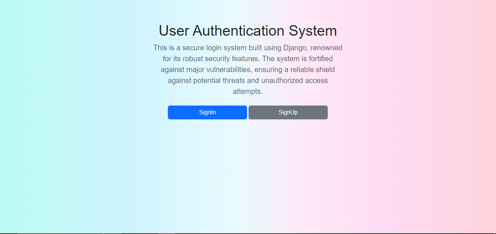

- SignUp Validator
    - Added validator for every important input field.

    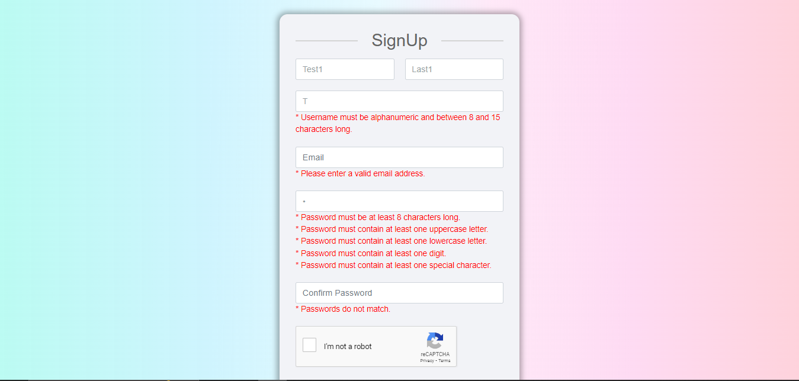

- Msg Notification of Email Send

    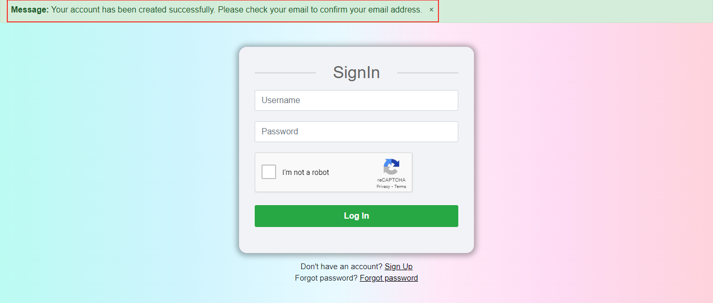

- Email with confirmation link
    - User have to click on link to confirm the account.

    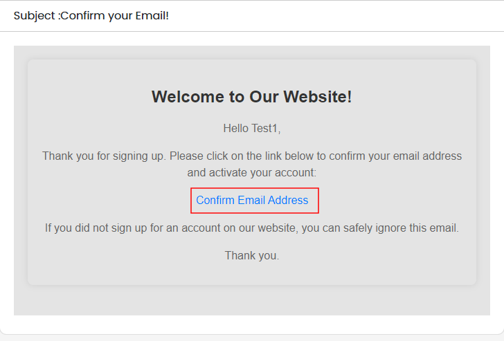

- Signin Without Activation
    - If user try to signin without activating account, then it will show this error message.

    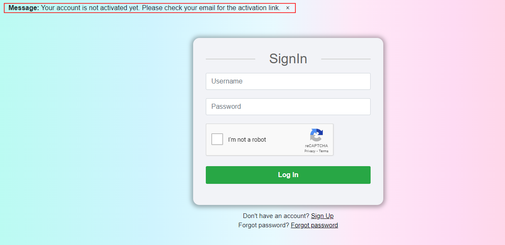

- Enter OTP After 2 Minute
    - If user try to enter OTP after 2 minutes it will show the error and send the new OTP on email id. And user also can send new mail with resend it link. 

    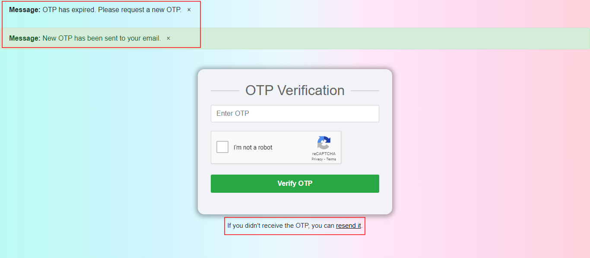

- New OTP is Sended

    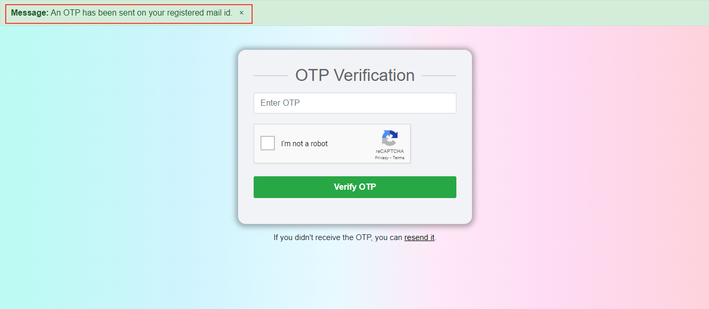

- Signin After Confirmation
    - After confirmation email user can signin to the account. 

    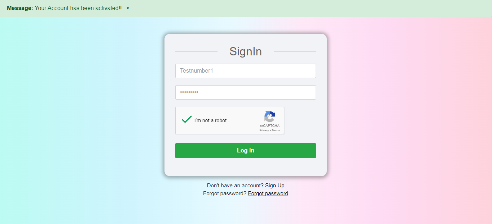

- Login Successful

    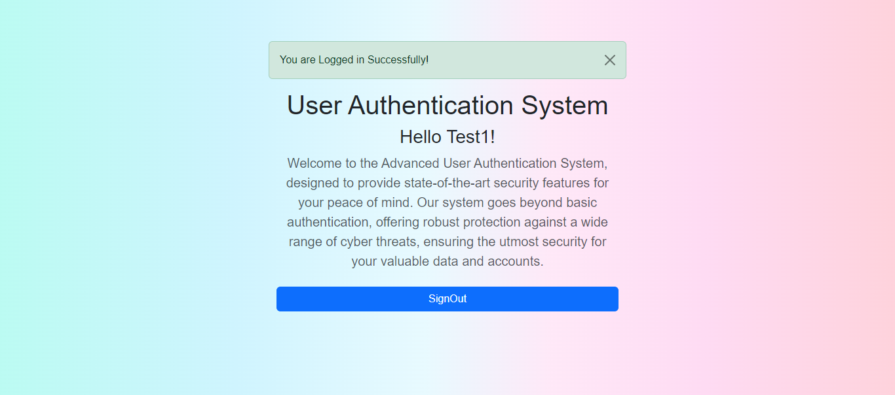

- Signup Using Existing Username and Email
    - If user can signup using existing username and email user can get error msg of it.

    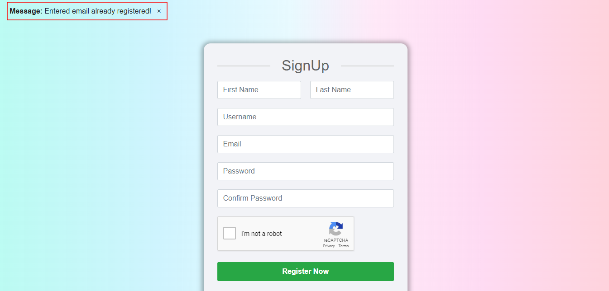
    
    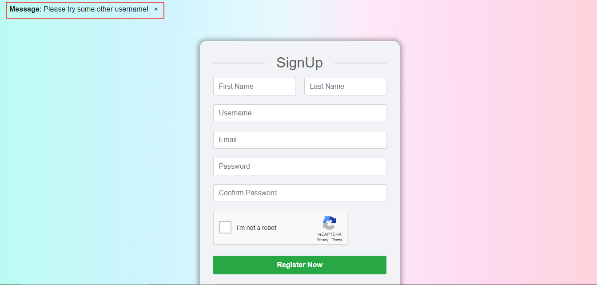

- Reset Password
    - User can access Reset password mechanism from Forgot Password section on signin page.

    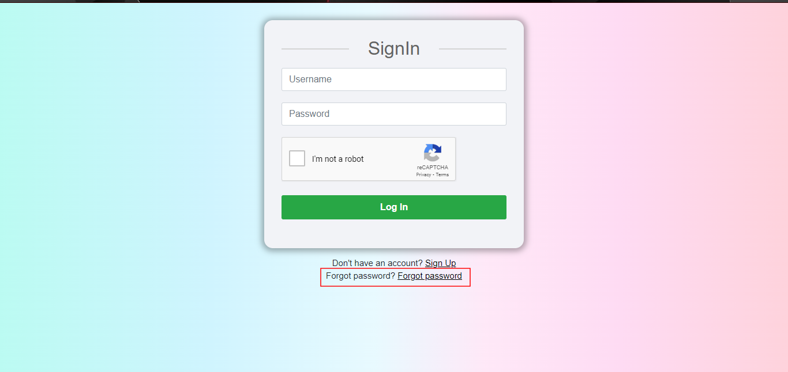
    
    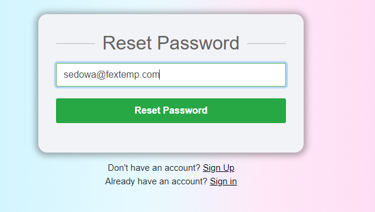

    - User can get email of reset password confirmation mail by entering registered email id.
    
    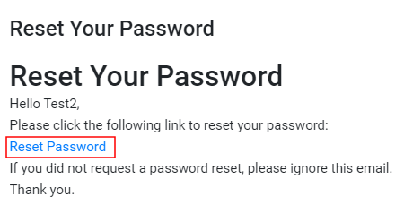
    
    - By clicking on the link first user will verified, and than it will open the password reset form where ser can enter their new password and that entered new password also will saved in hash form.
    
    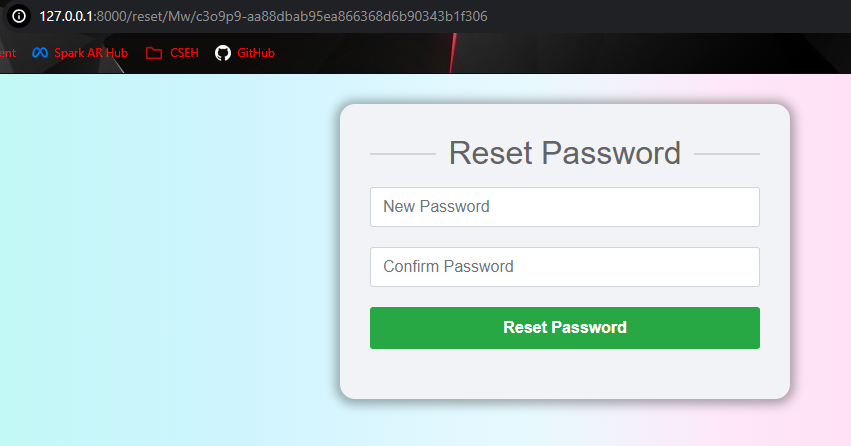
    
    - After sumitting the form user will get success message and redirected to signin page.
    
    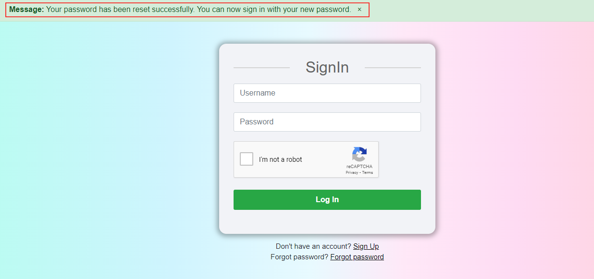

- Password in Hash
    - All the password are stored in hash form rather in plain text so if anyhow someone get the database than also user credential is safe.
    
    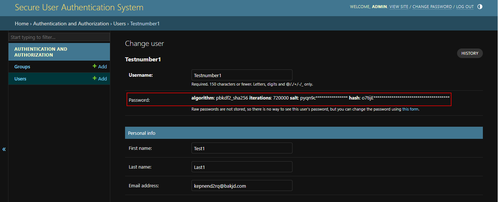

- Invalid Captcha
    - If user does not check reCAPTCHA checkbox they get error, it is useful for prevention from bruteforce attack.
    
    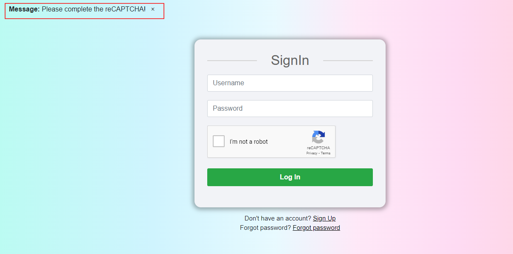

- SignOut
    - When user click on signout button he or she will not be able to access any data without relogin.
    
    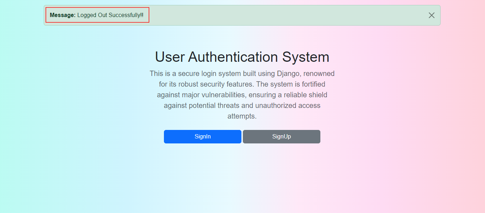

- Code Escape
    - Escape function implemented to prevent from any malicious user input, it will secure app from XSS, SQL Injection etc attacks.
    
    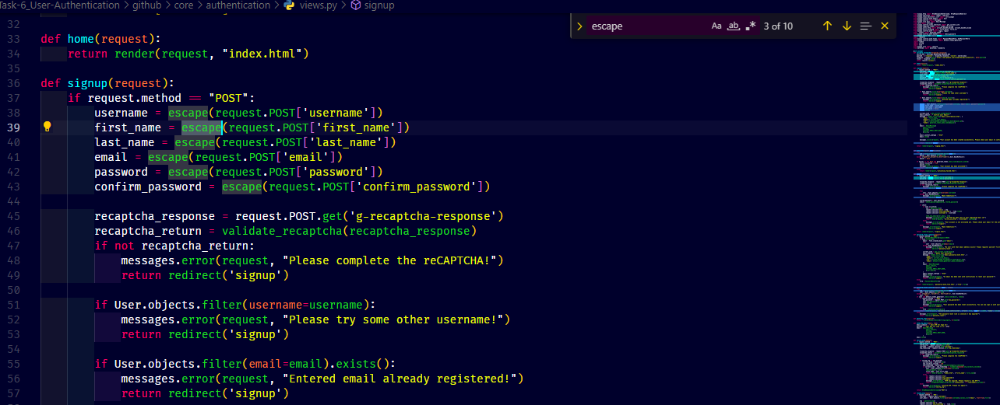

> [!NOTE]
> Default credential of django admin panel is `admin`/`password`

## License
This project is licensed under the [MIT License](LICENSE).
